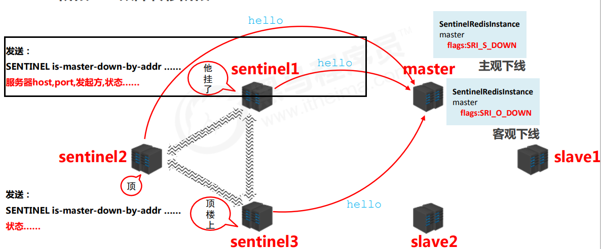

# Redis简介

Nosql：NOT-ONLY-SQL作为关系型数据的补充

特征：可扩容，可伸缩，大数据下高性能，灵活的数据类型，高可用

常用Nosql：Redis memcache HBase MongoDB

MongoDB：告诉缓存文档 （描述，详情，评论）

分布式文件系统：图片信息

ES，Lucene，slor：搜索关键字

Redis**：热点信息：高频，波段性**


**Redis**

概念: Redis (REmote DlctionaryServer)是用C语言开发的一个开源的高性能键值对(key-value) 数据库,

特征:

> 数据问没有必然的关联关系
> 内部采用单线程机制进行工作
> 高性能。 官方提供测试数据，50个并发执行00000个请求读的速度是10000次/,写的速度是81000次/s.


多数据类型支持

> 字符申类型string
> 列表类型list
> 散列类型hash
> 集合类型set
> 有序集合类型sorted. set


持久化，进行数据灾难恢复


**Redis的应用**

> 为热点数据加速查询(主要场景) ,如热点商品、热点新闻、热点资讯、推广类等高访问量信息等
> 任务队列，如秒杀、抢购、购票排队等
> 即时信息查询,如各位排行榜、各类网站访问统计、公交到站信息、在线人数信息(聊天室、网站)、设备信号等
> 时效性信息控制,如验证码控制、投票控制等
> 分布式数据共享,如分布式集群架构中的session分离
> 消息队列
> 分布式锁


# 基本数据类型

## String

### 基本操作

存储的数据:单个数据,最简单的数据存储类型,也是最常用的数据存储类型

存储数据的格式: 一个存储空间保存一个数据 

存储内容:通常使用字符串,如果字符串以整数的形式展示,可以作为数字操作使用

| 描述                                       | 代码                            |
| ------------------------------------------ | ------------------------------- |
| 添加/修改数据                              | set key value                   |
| 获取数据                                   | get key                         |
| 删除数据                                   | del key                         |
| 添加多个                                   | mset key1 value1 key2 value2... |
| 获取多个                                   | mget key1 key2...               |
| 获取字符串个数                             | strlen key                      |
| 追加到原信息后部，如果原始信息不存在就创建 | dappend key value               |

单数据操作与多数据操作的选择：因为发送请求set和回复result 处理操作都需要时间，如果单个发多条指令很浪费时间，可以选择多操作，但是多操作一次查询极大的数据量传输查询都需要很大时间消耗，所以两者要均衡使用


### 业务场景-1

大型企业级应用中,分表操作是基本操作,使用多张表存储同类型数据,但是对应的主键id必须保证统一性，不能重复。Oracle数据库具有sequence设定,可以解决该问题,但是MySQL数据库并不具有类似的机制,那么如何解决?

String类型数据的拓展操作

| 描述                            | 操作                      |
| ------------------------------- | ------------------------- |
| 设置数据增加指定范围值（默认1） | incr key                  |
| increment                       | incrby key increment      |
| float                           | incrbyfloat key increment |
| 设置数据减少指定范围值（默认1） | decr key                  |
| increment可以是负数             | decrby key increment      |


string作为数值操作

●string在redis内部存储默认就是一 个字符串 ,当遇到增减类操作incr , decr时会转成数值型进行计算。

●redis所有的操作都是原子性的 ,采用单线程处理所有业务，命令是一个一个执行的,因此无需考虑并发带来的数据影响。

●注意: 按数值进行操作的数据,如果原始数据不能转成数值，或超越了redis数值上限范围,将报错。9223372036854775807 ( java中long型数据最大值, Long.MAX_ _VALUE )

**Tips 1 :**

●redis用于控制数据库表主键id ,为数据库表主键提供生成策略,保障数据库表的主键唯一性
此方案适用于所有数据库,且支持数据库集群


### 业务场景-2

“最强女生”启动海选投票,只能通过微信投票,每个微信号每4小时只能投1票。

电商商家开启热门商品推荐,热门商品不能一直处于热门期,每种商品热门期维持3天, 3天后自动取消热门。

新闻网站会出现热点新闻,热点新闻最大的特征是时效性,如何自动控制热点新闻的时效性。

| 描述 | 操作                          |
| ---- | ----------------------------- |
| 秒   | key seconds value             |
| 毫秒 | psetex key milliseconds value |

Tips 2 :
● redis控制数据的生命周期,通过数据是否失效控制业务行为,适用于所有具有时效性限定控制的操作


### 业务场景-3

主页高频访问信息显示控制,例如新浪微博大V主页显示粉丝数与微博数量


解决方案

●在redis中为大V用户设定用户信息,以用户主键和属性值作为key ,后台设定定时刷新策略即可

eg:user: ​id:3506728370:fans→12210947

eg:user: id:3506728370:blogs→164

●在redis中以json格式存储大V用户信息,定时刷新(也可以使用hash类型)

eg:user: id:3506728370    {"id":3506728370,"name":"春晚","fans":12210862, "blogs' :6164, "focus":83}

**Tips3 :**

●redis应用于 各种结构型和非结构型高热度数据访问加速


### string类型数据操作的注意事项

- 数据操作不成功的反馈与数据正常操作之间的差异

  - 表示运行结果是否成功

    (integer)0 →false 失败

    (integer)1 →true成功

  - 表示运行结果值

    (integer)3 →3     3个

    (integer) 1→1     1个

- 数据未获取到

  ( nil )等同于null

- 数据最大存储量

  512MB

- 数值计算最大范围( java中的long的最大值)

  9223372036854775807

- key的设置约定

  数据库中的热点数据key命名惯例
          表名:主键名:主键值字段名
  eg1 :order : id :29437595: name
  eg2 :equip : id:390472345 : type
  eg3 :news : id:202004150 :title


## hash

> 新的存储需求:对一系列存储的数据进行编组,方便管理,典型应用存储对象信息
>
> 需要的存储结构 : 一个存储空间保存多个键值对数据
>
> hash类型:底层使用哈希表结构实现数据存储

hash存储结构优化

> 如果field数量较少存储结构优化为类数组结构
>
> 如果field数量较多存储结构使用HashMap结构

### 基本操作

| 描述                     | 操作                                     |
| ------------------------ | ---------------------------------------- |
| 设置指定                 | hset key field value                     |
| 获得指定                 | hget key field                           |
| 获得所有                 | hgetall key                              |
| 删除一个/多个            | hdel key fidle field2                    |
| 设置多个                 | hmset key field1 value1 field2 value2... |
| 获得多个                 | hmget key field1 field2...               |
| 字段长度                 | hlen key                                 |
| 哈希表里是否存在某字段   | hexists key field                        |
| 获得哈希表所有key        | hkeys key                                |
| 获得哈希表所有value      | hvals key                                |
| 增加指定字段指定范围的值 | hincrby key field increment              |
|                          | hincrbyfloat key field increment         |
|                          |                                          |

### hash类型数据操作的注意事项

hash类型下的value只能存储字符串,不允许存储其他数据类型,不存在嵌套现象。如果数据未获取到，对应的值为( nil )

每个hash可以存储2^32-1个键值对

hash类型十分贴近对象的数据存储形式,并且可以灵活添加删除对象属性。但**hash设计初衷不是为了存储大量对象而设计的**(field数量较多存储结构),切记不可滥用,更**不可以将hash作为对象列表使用**

hgetall操作可以获取全部属性,如果内部field过多,遍历整体数据效率就很会低,有可能成为数据访问瓶颈


### 业务场景-1

**电商购物车**


**业务分析**

●仅分析购物车的redis存储模型添加、浏览、更改数量、删除、清空

●购物车于数据库间持久化同步(不讨论)

●购物车于订单间关系(不讨论)   提交购物车:读取数据生成订单   商家临时价格调整:隶属于订单级别

●未登录用户购物车信息存储(不讨论)cookie存储


**解决方案**

一个用户的购物车作为一个key，filed是他所购买的商品，value是商品的数量

> 获得商品数量：hget
>
> 增加商品设置商品：hincrby，hset
>
> 全选：hgetall
>
> 删除hdel
>
> 总量：hlent

●以客户id作为key ,每位客户创建一个hash存储结构存储对应的购物车信息

●将商品编号作为field ,购买数量作为value进行存储

●添加商品:追加全新的field与value

●浏览:遍历hash

●更改数量:自增/自减，设置value值

●删除商品:删除field

●清空:删除key

●此处仅讨论购物车中的模型设计

●购物车与数据库间持久化同步、购物车与订单间关系、未登录用户购物车信息存储不进行讨论


**当前仅仅是将数据存储到了redis中,并没有起到加速的作用,商品信息还需要二次查询数据库**

每条购物车中的商品记录保存成两条field

●field1专用于保存购买数量

命名格式:商品id:nums

保存数据:数值

●field2专用于保存购物车中显示的信息,包含文字描述,图片地址,所属商家信息等

命名格式:商品id:info

保存数据: json

独立hash          hsetnx key field value


**Tips4 :**redis应用于购物车数据存储设计


### 业务场景-2

双11活动日,销售手机充值卡的商家对移动、联通、电信的30元、50元、 100元商品推出抢购活动,每种商品抢购.上限1000张

解决方案

> 以商家id作为key
> 将参与抢购的商品id作为field
> 将参与抢购的商品数量作为对应的value
> 抢购时使用降值的方式控制产品数量
> 实际业务中还有超卖等实际问题,这里不做讨论


**Tips 5 :**redis 应用于抢购,限购类、限量发放优惠卷、激活码等业务的数据存储设计


## list

●数据存储需求:存储多个数据，并对数据进入存储空间的顺序进行区分
●需要的存储结构: -一个存储空间保存多个数据，且通过数据可以体现进入顺序
●list类型: 保存多个数据，底层使用双向链表存储结构实现

| 描述                   | 操作                      |
| ---------------------- | ------------------------- |
| 从左边添加/修改        | lpush key value1 value2   |
| 从右边添加/修改        | rpush key value1 value2   |
| 获取数据（范围）       | lrange key start stop     |
| 获取数据（下标）       | lindex key index          |
| 获取长度               | llen key                  |
| 从左出                 | lpop key                  |
| 从右出                 | lpop key                  |
| 规定时间内获取得到数据 | blpop key1 [key2] timeout |
| 规定时间内获取得到数据 | brpop key1 [key2] timeout |
| 移除指定数据           | lrem key count value      |
|                        |                           |
|                        |                           |
|                        |                           |

不管你怎么放，都是从左往右读，最左边的索引为0 ，-1表示最后一个

左进做出，右进右出，就是有顺序

blpop key [key] 如果list是一个任务的集合，如果有任务就取出来，没任务就等，任务队列实现的基础操作


### 业务场景-1

朋友圈点赞，要求按照点赞顺序显式点赞好友信号

lrem key count value

左出右进


### list类型数据操作注意事项

list中保存的数据都是string类型的,数据总容量是有限的, 最多2^32-1个元素(4294967295)。

list具有索引 的概念,但是操作数据时通常以队列的形式进行入队出队操作,或以栈的形式进行入栈出栈操作

获取全部数据操作结束索引设置为-1

list可以对数据进行分页操作,通常第一页的信息来自于list ,第2页及更多的信息通过数据库的形式加载


### 业务场景-2

twitter、新浪微博、腾讯微博中个人用户的关注列表需要按照用户的关注顺序进行展示,粉丝列表需要将最近关注的粉丝列在前面
新闻、资讯类网站如何将最新的新闻或资讯按照发生的时间顺序展示?
企业运营过程中,系统将产生出大量的运营数据,如何保障多台服务器操作日志的统一顺序输出?


**解决方案**

依赖list的数据具有顺序的特征对信息进行管理

使用队列模型解决多路信息汇总合并的问题

使用栈模型解决最新消息的问题

**Tips 7** :redis 应用于最新消息展示


## set

list的查询效率是低的

> 新的存储需求:存储大量的数据,在查询方面提供更高的效率.
> 需要的存储结构:能够保存大量的数据,高效的内部存储机制,便于查询
> set类型:与hash存储结构完全相同,仅存储键,不存储值( nil) ,并且值是不允许重复的

set是用的hash的存储结构，只用了hash的field没用value


| 描述                       | 操作                       |
| -------------------------- | -------------------------- |
| 添加                       | sadd key member1 [member2] |
| 获取全部数据               | smembers key               |
| 删除数据                   | srem key member1 [member2] |
| 获取集合数据总量           | scard key                  |
| 判断集合中是否包含指定数据 | sismember key member       |

没有顺序的


### 业务场景-1

每位用户首次使用今日头条时会设置3项爱好的内容,但是后期为了增加用户的活跃度、兴趣点,必须让用户。对其他信息类别逐渐产生兴趣,增加客户留存度,如何实现?
业务分析
系统分析出各个分类的最新或最热点信息条目并组织成set集合，**随机**挑选其中部分信息，配合用户关注信息分类中的热点信息组织成展示的全信息集合

| 描述                                       | 操作                     |
| ------------------------------------------ | ------------------------ |
| 随机获取集合中指定数量的数据               | srandmember key  [count] |
| 随机获取集合中的某个数据并将该数据移出集合 | spop key  [count]        |

**redis应用于随机推荐类信息检索,例如热点歌单推荐,热点新闻推荐,热卖旅游线路,应用APP推荐**大V推荐等


### 业务场景-2

脉脉为了促进用户间的交流,保障业务成单率的提升,需要让每位用户拥有大量的好友,事实上职场新人不具有更多的职场好友,**如何快速为用户积累更多的好友**?

新浪微博为了增加用户热度,提高用户留存性,需要微博用户在关注更多的人,以此获得更多的信息或热门话题,**如何提高用户关注他人的总量**?

QQ新用户入网年龄越来越低,这些用户的朋友圈交际圈非常小,往往集中在一所学校甚至一个班级中**,如何帮助用户快速积累好友用户带来更多的活跃度**?

微信公众号是微信信息流通的渠道之一 , 增加用户关注的公众号成为提高用户活跃度的一种方式,如何**帮助用户积累更多关注的公众号**?

美团外卖为了提升成单量,必须帮助用户挖掘美食需求,如何推荐给用户最适合自己的美食?

共同好友

|                                  |                                     |
| -------------------------------- | ----------------------------------- |
| 交                               | sinter key1 [key2]                  |
| 并                               | sunion key1 [key2]                  |
| 差 A-B                           | sdiff key1 [key2]                   |
| 交（存到指定集合）               | sinterstore destination key1 [key2] |
| 并（存到指定集合）               | sunionstore destination key1 [key2] |
| 差（存到指定集合）               | sdiffstore destination key1 [key2]  |
| 将指定数据从原始集合移到目标集合 | smove source destination member     |


**Tips9 :**
redis 应用于同类信息的关联搜索,一二度关联搜索,深度关联搜索，

显示共同关注(一度) 交

显示共同好友(一度) 交

由用户A出发,获取到好友用户B的好友信息列表(一度) A-A∩B

由用户A出发,获取到好友用户B的购物清单列表(二度)

由用户A出发,获取到好友用户B的游戏充值列表(二度) 更深层次


### set类型数据操作的注意事项

●set 类型不允许数据重复,如果添加的数据在set中已经存在,将只保留一份，如果重复以后添加都失败

●set 虽然与hash的存储结构相同,但是无法启用hash中存储值的空间


### 业务场景-3

公司对旗下新的网站做推广,统计网站的PV(访问量),UV(独立访客),IP(独立IP)。

PV :网站被访问次数,可通过刷新页面提高访问量

UV :网站被不同用户访问的次数,可通过cookie统计访问量,相同用户切换IP地址，UV不变

IP :网站被不同IP地址访问的总次数，可通过IP地址统计访问量,相同IP不同用户访问IP不变


**解决方案**

利用set集合的数据去重特征,记录各种访问数据

- 建立string类型数据,利用incr统计日访问量( PV )
- 建立set模型,记录不同cookie数量( UV )
- 建立set模型,记录不同IP数量(IP)

```sql
127.0.0.1:6379> sadd ips 1.1.1.1 2.2.2.2 3.3.3.3 1.1.1.1
(integer) 3
```


**Tips 11 :**redis应用于同类型数据的快速去重


### 业务场景-4

**黑名单**

资讯类信息类网站追求高访问量,但是由于其信息的价值,往往容易被不法分子利用,通过爬虫技术,

快速获取信息,个别特种行业网站信息通过爬虫获取分析后，可以转换成商业机密进行出售。例如第三方火车票、机票、酒店刷票代购软件，电商刷评论、刷好评。
同时爬虫带来的伪流量也会给经营者带来错觉,产生错误的决策,有效**避免网站被爬虫反复爬取**成为每个网站都要考虑的基本问题。**在基于技术层面区分出爬虫用户后,需要将此类用户进行有效的屏蔽,这就是黑名单的典型应用**。

ps:不是说爬虫一定做摧毁性的工作,有些小型网站需要爬虫为其带来一些流量 。

**白名单**
对于安全性更高的应用访问,仅仅靠黑名单是不能解决安全问题的,此时需要设定可访问的用户群体,依赖白名单做更为苛刻的访问验证。

**解决方案**

基于经营战略设定问题用户发现、鉴别规则

**周期性更新满足规则的用户黑名单,加入set集合**

用户行为信息达到后与黑名单进行比对,确认行为去向

黑名单**过滤IP地址**:应用于开放游客访问权限的信息源

黑名单**过滤设备信息**:应用于限定访问设备的信息源

黑名单**过滤用户**:应用于基于访问权限的信息源


**Tips 12 :**redis 应用于基于黑名单与白名单设定的服务控制


## sorted_set

新的存储需求 :数据排序有利于数据的有效展示,需要提供-种可以根据自身特征进行排序的方式

需要的存储结构:新的存储模型,可以保存可排序的数据

sorted_set类型:**在set的存储结构基础上添加可排序字段**


**基于set模型，加了一个score字段，专门用来存排序字段，不是数据只用来排序**，withscores代表会显示scores

| 描述               | 操作                                                         |
| ------------------ | ------------------------------------------------------------ |
| 添加               | zadd key score1 member1[score2 member2]                      |
| 获取数据           | zrange key start stop [WITHSCORES]                           |
| 获取数据（倒着看） | zrevrange key start stop[withscores]                         |
| 删除数据           | zrem key member [member...]                                  |
| 按条件取           | zrangebyscore key min max [withscores] [limit] [offset] [count] |
| 按条件取           | zrevrangebyscore key min max [withscores]                    |
| 按索引删除         | zremrangebyrank key start stop                               |
| 按条件删除         | zremrangebyscore key min max                                 |

zrange scores 0 -1 withscores

zrangebyscore socres 70 80  limit 0 3 withscores  查询70-80 的从0开始的三条数据

注意:

min与max用于限定搜索查询的条件【针对于score】

start与stop用于限定查询范围,作用于索引,表示开始和结束索引【针对于数据索引】

offset与count用于限定查询范围,作用于查询结果,表示开始位置和数据总量


| 描述                   | 操作                                         |
| ---------------------- | -------------------------------------------- |
| 获取集合数据总量       | zcard key                                    |
| 获取集合数据范围内总量 | zcount key min max                           |
| 集合交操作             | zinterstore destination numkeys key [key...] |
| 集合并操作             | zunionstore destination numbeys key [key...] |


## 其他操作

### key的操作

**key的通用操作**

| 描述            | 操作       |
| --------------- | ---------- |
| 删除指定key     | del key    |
| 获取key是否存在 | exists key |
| key的类型       | type key   |

sort_set 是 zset类型


**时效性控制**

|                             | 描述                                               | 操作                                 |
| --------------------------- | -------------------------------------------------- | ------------------------------------ |
| 为key设置有效期             | 秒                                                 | expire key seconds                   |
|                             | 毫秒                                               | pexpire key milliseconds             |
|                             | (linux)                                            | expireat key timestamp               |
|                             | (linux)                                            | pexpireat key milliseconds-timestamp |
| 获取key的有效时间           | (返回-2表示key不存在，-1表示key存在，返回有效时常) | ttl key                              |
|                             | (毫秒)                                             | pttl key                             |
| 切换key从时效性转换为永久性 | (只返回状态是否改变成功了)                         | persist key                          |


**key查询操作**

| 描述                                                | 操作           |
| --------------------------------------------------- | -------------- |
| 查询所有                                            | keys *         |
| 查询所有以it开头                                    | keys it*       |
| 查询所有以heima结尾                                 | keys *heima    |
| 查询所有以u开头，以er:1结尾，中间包含一个字母，s或t | keys u[st]er:1 |
| 查询所有前面两个字符任意，后面以heima结尾           | keys ??heima   |
| 查询所有以user:开头，最后一个字符任意               | keys user:?    |
| 删除所有                                            | flushall       |
|                                                     | flushdb        |


**key的其他操作**

| 描述                                                         | 操作                |
| ------------------------------------------------------------ | ------------------- |
| 为key改名，newkey会覆盖key(包括数据)                         | rename key newkey   |
| 为key改名，不会覆盖数据                                      | renamenx key newkey |
| 对所有key的value排序(针对 list set sort_set) 只排序，不改变原数据 | sort key            |
| 其他key的通用操作                                            | help @generic       |


### db的基本操作

**key重复**

key是由程序员定义的，redis在使用过程中，伴随着操作数据量的增加，会出现大量的数据以及对应的key，数据不区分种类、类别混杂在一起，极易出现重复或冲突。

解决方案
redis为每个服务提供有16个数据库，编号从0到15，每个数据库之间的数据相互独立。


| 描述                                                        | 操作         |
| ----------------------------------------------------------- | ------------ |
| 切换数据库(默认0号数据库 127.0.0.1:6379[1])                 | select index |
| 退出(和esc一样)                                             | quit         |
| 测试和服务器有无联通，有返回XXX(XXX不写默认PANG),没有不返回 | ping [XXX]   |
| 打印日志信息，message的内容                                 | echo message |


| 描述                                                         | 操作        |
| ------------------------------------------------------------ | ----------- |
| 数据移动(库里没有无法移动，有相当于剪切，源库删除，目标添加。移动操作目标库必须没有对应key) | move key db |
| 库中有多少个key                                              | dbsize      |
| 删除当前库数据                                               | flushdb     |
| 删除所有数据                                                 | flushall    |


# linux安装redis及配置文件的使用

## 安装redis

[root@VM-0-6-centos ~]# wget http://download.redis.io/releases/redis-4.0.0.tar.gz

[root@VM-0-6-centos ~]# tar -xvf redis-4.0.0.tar.gz

[root@VM-0-6-centos ~]# cd redis-4.0.0/

[root@VM-0-6-centos redis-4.0.0]# make install

[root@VM-0-6-centos redis-4.0.0]# cd src

[root@VM-0-6-centos src]# redis-server


## redis的启动

redis换端口号

redis带参数启动，修改端口号

[root@VM-0-6-centos src]# redis-server --port 6380


客户端

[root@VM-0-6-centos src]# redis-cli
Could not connect to Redis at 127.0.0.1:6379: Connection refused
Could not connect to Redis at 127.0.0.1:6379: Connection refused
not connected> quit
[root@VM-0-6-centos src]# redis-cli -p 6380
127.0.0.1:6380> 


ctrl+C退出服务器

[root@VM-0-6-centos redis-4.0.0]# cat redis.conf | grep -v "#" |grep -v "^$"

bind 绑定的ip地址

port 6379
daemonize no
logfile "6379.log"
dir /redis-4.0.0/data


### 通过配置文件启动

1. 修改redis.conf 或者复制redis.conf

   [root@VM-0-6-centos redis-4.0.0]# cat redis.conf | grep -v "#" |grep -v "^$" > 目标文件

2. ctrl+C退出服务器

   port 6379
   daemonize no
   logfile "6379.log"
   ==dir ./data==

3. 启动

   redis-server redis.conf

   redis-cli redis.conf

4. 查看redis进程

   ps -ef|grep redis-


# 持久化

**持久化**

利用永久性存储介质将数据进行保存，在特定的时间将保存的数据进行恢复的工作机制称为持久化。 

**为什么要进行持久化** 

防止数据的意外丢失，确保数据安全性 

**持久化过程保存什么 **

-  将当前数据状态进行保存，==快照==形式，存储数据结果，存储格式简单，关注点在数据 （二进制）
-  将数据的操作过程进行保存，==日志==形式，存储操作过程，存储格式复杂，关注点在数据的操作过程 

## RDB

- 谁：redis操作者（用户）
- 什么时间：即时（随时进行） 
- 干什么事情：保存数据 


会生成一个dump.rdb文件          


### 启动方式——save

```
save     //手动执行一次保存操作
```


#### 相关配置

- dbfilename dump.rdb  
  - 说明：设置本地数据库文件名，默认值为 dump.rdb 
  - 经验：通常设置为dump-端口号.rdb 

- dir  
  - 说明：设置存储.rdb文件的路径 
  - 经验：通常设置成存储空间较大的目录中，目录名称data 

- rdbcompression yes  
  - 说明：设置存储至本地数据库时是否压缩数据，默认为 yes，采用 LZF 压缩 
  - 经验：通常默认为开启状态，如果设置为no，可以节省 CPU 运行时间，但会使存储的文件变大（巨大）

-  rdbchecksum yes  
  - 说明：设置是否进行RDB文件格式校验，该校验过程在写文件和读文件过程均进行 
  -  经验：通常默认为开启状态，如果设置为no，可以节约读写性过程约10%时间消耗，但是存储一定的数据损坏风险 


#### save指令工作原理

单线程任务执行顺序

.... -> save -> set -> set

save指令的执行会阻塞当前Redis服务器，直到当前RDB过程完成为止，有可能会造成长时间阻塞，==线上环境不建议使用==


### 启动方式——bgsave


```
bgsave   //手动启动后台保存
```

调用linux fork函数生成一个子进程 ，创建rdb文件，不参与redis指令序列

                                                                                                                                                                                           


#### 工作原理


 bgsave命令是针对save阻塞问题做的优化。Redis内部所有涉及到RDB操作都采用bgsave的方式，save命令可以放弃使用。 


#### 相关配置

-  dbfilename dump.rdb  
-  dir  
-  rdbcompression yes  
-  rdbchecksum yes  
- stop-writes-on-bgsave-error yes  
  - 说明：后台存储过程中如果出现错误现象，是否停止保存操作 
  - 经验：通常默认为开启状态 

### 启动方式——save配置

```
save second changes
//满足限定时间范围内key的变化数量达到指定数量即进行持久化 
//second：监控时间范围 
//changes：监控key的变化量 
//再conf文件中配置

 save 900 1 
 save 300 10 
 save 60 10000 
```


#### save配置原理

后台是bgsave   

会对数据产生影响（get就不会 set/delete会） 

不进行数据比对（不会拿现在值和原来比对，比如对一个值连续两次set

```
set name 11
set name 11
//不会发生变化
set name 11 
set name 22
//会发生变化
```


注意：

-  save配置要根据实际业务情况进行设置，频度过高或过低都会出现性能问题，结果可能是灾难性的             
- save配置中对于second与changes设置通常具有互补对应关系，尽量不要设置成包含性关系             
- save配置启动后执行的是bgsave操作 

#### save配置相关配置 

-  dbfilename dump.rdb   文件名
- dir   文件地址（全路径）
- rdbcompression yes  文件压缩
- rdbchecksum yes  文件检验


### 两种启动方式对比


### RDB特殊启动形式

- 全量复制 在主从复制中详细讲解 

- 服务器运行过程中重启 

  ```
   debug reload
  ```

- 关闭服务器时指定保存数据 

  ```
  shutdown save
  ```

**默认情况下执行shutdown命令时，自动执行 bgsave(如果没有开启AOF持久化功能)** 

redis是单线程，bgsave是启动另一个进程哦


### RDB优缺点

**优点**

- RDB是一个紧凑压缩的**二进制文件**，存储效率较高 
- RDB内部存储的是redis在某个时间点的数据快照，非常适合用于数据备份，**全量复制**等场景 
- **RDB恢复数据的速度要比AOF快很多** 
- 应用：服务器中每X小时执行bgsave备份，并将RDB文件拷贝到远程机器中，用于灾难恢复

**缺点**

- RDB方式无论是执行指令还是利用配置，**无法做到实时持久化**，具有较大的可能性丢失数据 
- bgsave指令每次运行要执行**fork**操作创建子进程，要**牺牲掉一些性能** 
- Redis的众多版本中**未进行RDB文件格式的版本统一**，有可能出现各版本服务之间数据格式无法兼容现象 （把2.0的数据取出来然后存到数据库里或者其他文件中，然后把这个文件当作恢复的数据源）

## AOF

### AOF基本操作

#### 引子

**RDB存储的弊端** 

-  存储数据量较大，效率较低。基于快照思想，**每次读写都是全部数据，当数据量巨大时，效率非常低** 
- **大数据量下的IO性能较低** 
- 基于**fork**创建子进程，**内存产生额外消耗** 
- 宕机带来的数据丢失风险 

**解决思路**

- 不写全数据，仅记录部分数据 
- 降低区分数据是否改变的难度，改**记录数据为记录操作过程** 
- 对所有操作均进行记录，排除丢失数据的风险 

#### 概念

以独立日志的方式记录每次写命令，重启时再重新执行AOF文件中命令达到恢复数据的目的。与RDB相比可以简单描述为改记录数据为记录数据产生的过程 

**AOF的主要作用是解决了数据持久化的实时性**，目前已经是Redis持久化的主流方式 

#### AOF写过程


#### AOF写数据三种策略

- always(每次） 每次写入操作均同步到AOF文件中，数据零误差，性能较低，不建议使用。
- everysec（每秒） 每秒将缓冲区中的指令同步到AOF文件中，数据准确性较高，性能较高，建议使用，也是默认配置 在系统突然宕机的情况下丢失1秒内的数据 
- no（系统控制） 由操作系统控制每次同步到AOF文件的周期，整体过程不可控


**功能开启**

**配置** 

```
 appendonly yes|no 
 //作用 是否开启AOF持久化功能，默认为不开启状态
```


```
 appendfsync always|everysec|no 
 //作用 AOF写数据策略 
```


#### AOF相关配置

```
 appendfilename filename 
 //作用 AOF持久化文件名，默认文件名未appendonly.aof，建议配置为appendonly-端口号.aof 
```


```
 dir
 // 作用 AOF持久化文件保存路径，与RDB持久化文件保持一致即可
```


前面是文件个格式头


### 重写

#### 概念

随着命令不断写入AOF，文件会越来越大，为了解决这个问题，Redis引入了AOF**重写机制**压缩文件体积。AOF文件重写是将Redis进程内的数据转化为写命令同步到新AOF文件的过程。简单说就是将对**同一个数据的若干个条命令执行结果转化成最终结果数据对应的指令进行记录**

#### 作用

- 降低磁盘占用量，提高磁盘利用率 
- 提高持久化效率，降低持久化写时间，提高IO性能
- 降低数据恢复用时，提高数据恢复效率 

#### AOF重写规则

-  进程内已超时的数据不再写入文件 （超时==数据没了）
- 忽略无效指令，重写时使用进程内数据直接生成，这样新的AOF文件只保留最终数据的写入命令 如del key1、 hdel key2、srem key3、set key4 111、set key4 222等 
- 对同一数据的多条写命令合并为一条命令 如lpush list1 a、lpush list1 b、 lpush list1 c 可以转化为：lpush list1 a b c。 为防止数据量过大造成客户端缓冲区溢出，对list、set、hash、zset等类型，每条指令最多写入64个元素 

#### AOF重写方式

#####  **手动重写** 

```
bgrewriteaof 
```


**工作原理**：第三步创建aof文件


  

##### **自动重写** 

```
 auto-aof-rewrite-min-size size 
 auto-aof-rewrite-percentage percentage
```


**自动重写方式**

-  自动重写触发条件设置 

```
auto-aof-rewrite-min-size size  aof文件达到的大小
auto-aof-rewrite-percentage percent  （aof文件当前文件大小-aof基本文件大小）/aof基本文件大小达到的比例
```

- 自动重写触发比对参数（ 运行指令info Persistence获取具体信息 ） 

客户端调用info指令   列出redis运行属性值

```
aof_current_size 
aof_base_size 
```

- 自动重写触发条件 

```
aof_current_size > auto-aof-rewrite-min-size
(aof_current_size - aof_base_size)/aof_base_size > auto-aof-rewrite-percentage
```

（当前尺寸-基础尺寸）/基础尺寸>自动重写百分比

**触发一个就会执行重写**


### AOF工作流程

always：使用aof，会根据自己设置的appendonly  appendfsync 属性生成aof文件，这个是在后台开启的另一个进程（fork）

everysec：fork进程生成的日志缓存到aof缓存区，然后满足条件了（everysec）再写进 .aof文件


everysec+重写：

- 3-1 到 4 是没有重写的aof（一个fork进程，比如fork1）会生成两个缓存区：aof缓存区，aof重写缓存区
- 主进程执行手动重写（bgrewriteaof）又是另一个fork进程 fork2
- fork2根据fork1给的数据从aof重写缓存区中得到数据进行重写
- 生成重写后的aof
- 重写后的aof覆盖 没重写的aof


## RDB与AOF区别


- 占用存储空间：rdb只是数据可以压缩，aof是操作数据的整个过程，肯定会大一些
- 存储速度：大数据rdb io慢，读写全部数据，效率低。
- 恢复速度：aof是执行指令需要时间
- 资源消耗：

#### RDB与AOF的选择之惑 

- 对数据非常敏感，建议使用默认的AOF持久化方案 

  AOF持久化策略使用everysecond，每秒钟fsync一次。该策略redis仍可以保持很好的处理性能，当出现问题时，最多丢失0-1秒内的数据。 

  注意：由于AOF文件存储体积较大，且恢复速度较慢 

- 数据呈现阶段有效性，建议使用RDB持久化方案 

  数据可以良好的做到阶段内无丢失（该阶段是开发者或运维人员手工维护的），且恢复速度较快，阶段点数据恢复通常采用RDB方案

  注意：利用RDB实现紧凑的数据持久化会使Redis降的很低，慎重 

- 综合比对 

  RDB与AOF的选择实际上是在做一种权衡，每种都有利有弊 

  如不能承受数分钟以内的数据丢失，对业务数据非常敏感，选用AOF 

  如能承受数分钟以内的数据丢失，且追求大数据集的恢复速度，选用RDB 

  灾难恢复选用RDB 

  双保险策略，同时开启 RDB 和 AOF，重启后，Redis优先使用 AOF 来恢复数据，降低丢失数据的量

## 持久化应用场景

redis持久化保存的是什么

快照（数据）RDB：二进制

日志（过程）AOF：数据操作过程


RDB启动方式

save方式 


RDB相关配置

rm -rf dump.rdb 删除文件        

数据回复的话服务器启动就会自动恢复了


# 事务

## 概念

redis事务就是一个命令执行的队列，将一系列预定义命令包装成一个整体（一个队列）。当执行时，一次性按照添加顺序依次执行，中间不会被打断或者干扰。 

一个队列中，一次性、顺序性、排他性的执行一系列命令 

## 问题

没有事务的时候会出现的问题，相当于mysql的==脏读==

举例如下：

客户端1


客户端2


## 事务的使用

- 开启事务 

  ```
  multi
  //作用 设定事务的开启位置，此指令执行后，后续的所有指令均加入到事务中
  ```

-  执行事务 

  ```
  exec
  //作用 设定事务的结束位置，同时执行事务。与multi成对出现，成对使用 
  ```

- 取消事务

  ```
  discard
  //终止当前事务的定义，发生在multi之后，exec之前 
  ```

**注意：加入事务的命令暂时进入到任务队列中，并没有立即执行，只有执行exec命令才开始执行** 

 

开始事务，执行事务


开启事务-取消事务


如图


指令格式对的，但无法正确执行

**已经执行完毕的命令对应的数据不会自动回滚，需要程序员自己在代码中实现回滚。**

> 指令写错会报错
>
> 指令写错了，提交事务==自动取消事务
>
> 指令写错，可以取消事务==取消事务


tips：

定义事务的过程中，**命令格式输入错误**怎么办？ 

- 语法错误：指命令书写格式有误 
- 处理结果：如果定义的事务中所包含的命令存在语法错误，整体事务中所有命令均不会执行。包括那些语法正确的命令。 

定义事务的过程中，**命令执行出现错误**怎么办？ 

- 运行错误 指命令格式正确，但是无法正确的执行。例如对list进行incr操作 
- 处理结果 能够正确运行的命令会执行，运行错误的命令不会被执行 

## 手动事务回滚

记录操作过程中被影响的数据之前的状态 

- 单数据：string 
- 多数据：hash、list、set、zset 

设置指令恢复所有的被修改的项 

- 单数据：直接set（注意周边属性，例如时效）  
- 多数据：修改对应值或整体克隆复制


# 锁

使用场景：

天猫双11热卖过程中，对已经售罄的货物追加补货，4个业务员都有权限进行补货。补货的操作可能是一系列的操作，牵扯到多个连续操作，==如何保障不会重复操作==？ 

多个客户端有可能同时操作同一组数据，并且该数据一旦被操作修改后，将不适用于继续操作 

在操作之前锁定要操作的数据，一旦发生变化，终止当前操作 

 对 key 添加监视锁，**在执行exec前如果key发生了变化，终止事务执行** 

```
watch key1 [key2……] 
```

取消对所有 key 的监视 

```
unwatch
```


watch了name之后，那么（被自己，别人）改变了，watch之后的第一事务是无效的。那么这个watch也结束了，就是说再改变name，之后的事务是可以提交的。


可以使用unwatch对key解除锁定。之后的操作都是正常的


## 分布式锁

使用场景：

天猫双11热卖过程中，对已经售罄的货物追加补货，且补货完成。客户购买热情高涨，3秒内将所有商品购买完毕。本次补货已经将库存全部清空，如何避免最后一件商品不被多人同时购买？【超卖问题】 

使用watch监控一个key有没有改变已经不能解决问题，此处要监控的是具体数据

虽然redis是单线程的，但是多个客户端对同一数据同时进行操作时，如何避免不被同时修改？ 


 使用 setnx 设置一个公共锁 

```
setnx lock-key value 
del lock-key
```

利用setnx命令的返回值特征，有值则返回设置成功，无值则返回设置失败 

- 对于返回设置成功的，拥有控制权，进行下一步的具体业务操作 
- 对于返回设置失败的，不具有控制权，排队或等待   操作完毕通过del操作释放锁 

注意：上述解决方案是一种设计概念，依赖规范保障，具有风险性 


==就是一个默认的规则，访问这个数据就必须上锁，然后操作数据，然后删除==

==如果不默认这个规则，别的客户端也是能看见的也能修改的==


## 分布式锁+时间

依赖分布式锁的机制，某个用户操作时对应客户端宕机，且此时已经获取到锁。如何解决？ 

- 由于锁操作由用户控制加锁解锁，必定会存在加锁后未解锁的风险
- 需要解锁操作不能仅依赖用户控制，系统级别要给出对应的保底处理方案 


使用 expire 为锁key添加时间限定，到时不释放，放弃锁 

```
expire lock-key second
pexpire lock-key milliseconds
```

由于操作通常都是微秒或毫秒级，因此该锁定时间不宜设置过大。具体时间需要业务测试后确认。

-  例如：持有锁的操作最长执行时间127ms，最短执行时间7ms。 
- 测试百万次最长执行时间对应命令的最大耗时，测试百万次网络延迟平均耗时 
- 锁时间设定推荐：最大耗时*120%+平均网络延迟*110% 
- 如果业务最大耗时<<网络平均延迟，通常为2个数量级，取其中单个耗时较长即可

锁上之后，宕机了，没释放锁，别的客户端遵守规则就永远获得不到锁


为锁设置时间


不是事务状态：普通指令，开启一个事务multi

是事务状态：已经进入事务了


# 删除策略

## 过期数据

Redis是一种内存级数据库，所有数据均存放在内存中，内存中的数据可以通过TTL指令获取其状态

- XX ：具有时效性的数据 
-  -1 ：永久有效的数据 
- -2 ：已经过期的数据 或 被删除的数据 或 未定义的数据 \

那些到时间了的数据他过期了，然后不是一下子删除的，是会等一会再删除的。是有策略的，就是**删除策略**

## 删除策略

### 时效性数据存储结构


hash结构

expire key time

ttl key

**删除策略的目标**

在内存占用与CPU占用之间寻找一种平衡，顾此失彼都会造成整体redis性能的下降，甚至引发服务器宕机或内存泄露

### 定时删除

- 创建一个定时器，当key设置有过期时间，且过期时间到达时，由定时器任务立即执行对键的删除操作 （**死期到了就消灭**）
- 优点：节约内存，到时就删除，快速释放掉不必要的内存占用 
- 缺点：CPU压力很大，无论CPU此时负载量多高，均占用CPU，会影响redis服务器响应时间和指令吞吐量 
- **总结：用处理器性能换取存储空间（拿时间换空间）**

### 惰性删除

- 数据到达过期时间，不做处理。等==下次访问该数据时== 
  -  如果未过期，返回数据 
  -  发现已过期，删除，返回不存在 

- 优点：节约CPU性能，发现必须删除的时候才删除
- 缺点：内存压力很大，出现长期占用内存的数据 
- 总结：用存储空间换取处理器性能（拿时间换空间）

在get key的时候调用expireIfNeeded()看他死没死

内部都会操作这个函数，判断有没有过期

### 定期删除

以上两种策略都有可能造成以下问题之一：CUP用爆（指令太多了），服务器用爆（存的数太多了）。

**定期删除**

- Redis启动服务器初始化时，读取配置server.hz的值，默认为10 
- 每秒钟执行server.hz次serverCron() ----databasesCron()----activeExpireCycle()
- activeExpireCycle()对每个expires[*]逐一进行检测，每次执行250ms/server.hz
- 对某个expires[\*]检测时，随机挑选W个key检测 
  - 如果key超时，删除key 
  - 如果一轮中删除的key的数量>W\*25%，循环该过程 
  - 如果一轮中删除的key的数量≤W\*25%，检查下一个expires[\*]，0-15循环 
  - W取值=ACTIVE_EXPIRE_CYCLE_LOOKUPS_PER_LOOP属性值

-  参数current_db用于记录activeExpireCycle() 进入哪个expires[*] 执行 
-  如果activeExpireCycle()执行时间到期，下次从current_db继续向下执行

1s 10次serverCron servreCron会执行databasesCron() databaseCron执行activeExpireCycle 

```
250ms一次server.hz  在这次里面，我们要对16个数据库做activeExpireCycle，那么这250ms不够的话，可能就轮询了几个数据库，后面没有轮到，用current_db记录值
```

#### 总结

- 周期性轮询redis库中的时效性数据，采用随机抽取的策略，利用过期数据占比的方式控制删除频度 
- 特点1：CPU性能占用设置有峰值，检测频度可自定义设置 
- 特点2：内存压力不是很大，长期占用内存的冷数据会被持续清理  总结：周期性抽查存储空间 expireIfNeeded() （随机抽查，重点抽查）

### 对比

| 名称     | 内存                     | CPU                           |
| -------- | ------------------------ | ----------------------------- |
| 定时删除 | 节约内存，过期数据无占用 | 不分时段占用CPU资源，频度高   |
| 惰性删除 | 内存占用严重             | 延时执行，CPU利用率高         |
| 定期删除 | 内存定期随机清理         | 每秒花费固定的CPU资源维护内存 |

## 逐出算法

### 内存不足

- Redis使用内存存储数据，在执行每一个命令前，会调用freeMemoryIfNeeded()检测内存是否充足。如 果内存不满足新加入数据的最低存储要求，redis要临时删除一些数据为当前指令清理存储空间。清理数据 的策略称为逐出算法。
- 注意：逐出数据的过程不是100%能够清理出足够的可使用的内存空间，如果不成功则反复执行。当对所 有数据尝试完毕后，如果不能达到内存清理的要求，将出现错误信息。


### 影响数据逐出的配置

- 最大可使用内存 

  ```
  maxmemory
  //占用物理内存的比例，默认值为0，表示不限制。生产环境中根据需求设定，通常设置在50%以上。
  ```

-  每次选取待删除数据的个数 

  ```
  maxmemory-samples
  选取数据时并不会全库扫描，导致严重的性能消耗，降低读写性能。因此采用随机获取数据的方式作为待检测删除数据 
  ```

- 删除策略 

  ```
  maxmemory-policy
  达到最大内存后的，对被挑选出来的数据进行删除的策略
  ```

**策略**

- 检测易失数据（可能会过期的数据集server.db[i].expires ） 

  ① volatile-lru：挑选最近最少使用的数据淘汰 （最长时间没有用）

  ② volatile-lfu：挑选最近使用次数最少的数据淘汰 （一段时间次数最少）

  ③ volatile-ttl：挑选将要过期的数据淘汰 （按过期时间）

  ④ volatile-random：任意选择数据淘汰 

- 检测全库数据（所有数据集server.db[i].dict ） 

  ⑤ allkeys-lru：挑选最近最少使用的数据淘汰 

  ⑥ allkeys-lfu：挑选最近使用次数最少的数据淘汰 

  ⑦ allkeys-random：任意选择数据淘汰 

- 放弃数据驱逐 

  ⑧ no-enviction（驱逐）：禁止驱逐数据（redis4.0中默认策略），会引发错误OOM（Out Of Memory）


**内存泄漏**：一些没用的数据存在内存

内存溢出：内存空间不够了

**数据逐出策略配置依据** 

使用INFO命令输出监控信息，查询缓存 hit 和 miss（命中 丢失次数） 的次数，根据业务需求调优Redis配置

# 服务器配置

## 服务器端设定 

- 设置服务器以守护进程的方式运行 

```
daemonize yes|no
```

- 绑定主机地址 

```
 bind 127.0.0.1 
```

- 设置服务器端口号 

```
 port 6379
```

- 设置数据库数量  

```
databases 16
```

##  日志配置

- 设置服务器以指定日志记录级别 

```
 loglevel debug|verbose|notice|warning 
 //级别越高打印的约少，warning级别最高
```

- 日志记录文件名 

```
logfile 端口号.log 
```

- 注意：日志级别开发期设置为verbose即可，生产环境中配置为notice，简化日志输出量，降低写日志IO的频度

## 客户端配置

- 设置同一时间最大客户端连接数，默认无限制。当客户端连接到达上限，Redis会关闭新的连接 

```
maxclients 0
```

- 客户端闲置等待最大时长，达到最大值后关闭连接。如需关闭该功能，设置为 0  

```
timeout 300 服务器基础配置 
```

## 多服务器快捷配置

- 导入并加载指定配置文件信息，用于快速创建redis公共配置较多的redis实例配置文件，便于维护

```
include /path/server-端口号.conf
```


# 高级数据类型

## bitmaps

存储需求：表示一种状态，是男是女，是好是坏，看了吗没看

bitmaps 是针对String的每个位置 只能存0或1

### 基础操作

- 获取指定key对应偏移量上的bit值 

  ```
  getbit key offset
  ```

- 设置指定key对应偏移量上的bit值，value只能是1或0

  ```
  setbit key offset value
  ```


业务场景

1. 统计每天某一部电影是否被点播     一个位置上的值的0 1
2. 统计每天有多少部电影被点播      一个string的1多少个
3. 统计每周/月/年有多少部电影被点播    每天的String做或操作，得到的数据1的数量
4. 统计年度哪部电影没有被点播     或操作 0的数量
5. （与操作，可以是都放了）

### 拓展操作

对指定key按位进行交、并、非、异或操作，并将结果保存到destKey中 

- and：交 
- or：并 
- not：非 
- xor：异或 

```
bitop op destkey key1 [key2,...]
```

统计指定key中1的数量

```
bitcount key [start end]
//不写就是整个String
```


电影1 offset=0 说明今天没被播  每个offset代表某部电影 0/1代表播没播

每天多少部电影=1的数量

每周/月/年多少电影被点播把所有值求或操作


## HpyperLogLog   UV

### 基数

- 基数是数据集去重后元素个数 
- HyperLogLog 是用来做基数统计的，运用了LogLog的算法

{1, 3, 5, 7, 5, 7, 8} 基数集： {1, 3, 5 ,7, 8} 基数：5 

{1, 1, 1, 1, 1, 7, 1} 基数集： {1,7} 基数：2

### 基本操作

- 添加数据 

```
pfadd key element [element...]
```

- 统计数据 

```
pfcount key [key....]
```

- 合并数据

```
pfmerge destkey sourcekey [sourcekey]
//得到的是HyperLogLog类型还要用pfcount统计
```


001 002得不到了，它是处理数据，不是存储数据，只记录数量，不记录具体数据


### 说明

- 用于进行基数统计，不是集合，不保存数据，只记录数量而不是具体数据 
- 核心是基数估算算法，最终数值存在一定误差 
- 误差范围：基数估计的结果是一个带有 0.81% 标准错误的近似值 
- 耗空间极小，每个hyperloglog key占用了12K的内存用于标记基数
- pfadd命令不是一次性分配12K内存使用，会随着基数的增加内存逐渐增大
- Pfmerge命令合并后占用的存储空间为12K，无论合并之前数据量多少

## GEO(距离)

### 基本操作

- 添加坐标点 

```
geoadd key longitude latitude member [longitude latitude member ...]
//key ==容器（一个装点的容器）    横坐标  纵坐标   名称
```

- 获取坐标点 

```
geopos key member [member ...]
显示的是经纬度的度分秒
```

- 计算坐标点距离

```
geodist key member1 member2 [unit单位]
默认单位是m
```


### 其他操作

- 容器内坐标 radius范围内的点

```
georadius key longitude latitude radius m|km|ft|mi [withcoord] [withdist] [withhash] [count count]
坐标是longitude latitude 
半径是radius
withcoord  坐标带上
withdist  距离带上
withhash 
count count 取一下范围
asc desc 升序降序排序
```

- 容器内点 radius范围内的点

```
georadiusbymember key member（坐标直接换成容器里的点） radius m|km|ft|mi [withcoord] [withdist] [withhash] [count count] 
```

- 计算经纬度  

```
geohash key member [member ...]
```


开车要是加点的话，在数据集里就太多了，所以用坐标求


# 主从复制

- 三高架构：高并发，高性能，高可用

**单机redis的风险与问题**

- 问题1.机器故障 
  - 现象：硬盘故障、系统崩溃 
  - 本质：数据丢失，很可能对业务造成灾难性打击 
  - 结论：基本上会放弃使用redis. 

- 问题2.容量瓶颈 
  - 现象：内存不足，从16G升级到64G，从64G升级到128G，无限升级内存 
  - 本质：穷，硬件条件跟不上
  - 结论：放弃使用redis 

- 结论： 为了避免单点Redis服务器故障，准备多台服务器，互相连通。将数据复制多个副本保存在不同的服务器上，连接在一起，并保证**数据是同步**的。即使有其中一台服务器宕机，其他服务器依然可以继续提供服务，实现Redis的高可用，同时**实现数据冗余备份**


**多台服务器连接方案**

- 提供数据方：master 主服务器，主节点，主库，主客户端 
- 接收数据方：slave 从服务器，从节点，从库，从客户端 
- 需要解决的问题： 数据同步 
- 核心工作： master的数据复制到slave中

## 主从复制简介

主从复制即将master中的数据即时、有效的复制到slave中 

- 特征：一个master可以拥有多个slave，一个slave只对应一个master 
- 职责： 
  - master: 写数据 执行写操作时，将出现变化的数据自动同步到slave，读数据（可忽略） 
  - slave: 读数据，写数据（禁止）

## 主从复制作用

- 读写分离：master写、slave读，提高服务器的读写负载能力 
- 负载均衡：基于主从结构，配合读写分离，由slave分担master负载，并根据需求的变化，改变slave的数量，通过多个从节点分担数据读取负载，大大提高Redis服务器并发量与数据吞吐量 
- 故障恢复：当master出现问题时，由slave提供服务，实现快速的故障恢复 
- 数据冗余：实现数据热备份，是持久化之外的一种数据冗余方式 
- 高可用基石：基于主从复制，构建哨兵模式与集群，实现Redis的高可用方案(（因为复制结构）实时的备份)

一台slave宕机，还有别的slave顶着

master宕机，用一台slave当master

master压力很大，让slave（master）分担一下，追加下一级slave，会带来别的问题

多个计算机做master（哨兵）

## 主从复制工作流程

### 建立连接阶段

- 建立slave到master的连接，使master能够识别slave，并保存slave端口号

步骤1：设置master的地址和端口，保存master信息 

步骤2：建立socket连接 

步骤3：发送ping命令（定时器任务） 

步骤4：身份验证 

步骤5：发送slave端口信息 至此，主从连接成功！


** **

slave： 保存master的地址与端口 

master： 保存slave的端口 

总体： 之间创建了连接的socket


两台服务器（两个计算机）

slave发送的指令要多一些

slave客户端发了命令给slave  内部slave发给master 


master权限认证，设置密码了。slave身份验证，master验证授权

最后一步 把自己端口发给master 通过这个端口监听自己


配置文件


#### 搭建

```
页面1
[root@VM-0-7-centos ~]# redis-server /root/redis-4.0.0/conf/redis-6379.conf

页面2
[root@VM-0-7-centos ~]# redis-server /root/redis-4.0.0/conf/redis-6380.conf

客户端1（chengdu3）
redis-cli -p 6380
salveof 127.0.0.1 6379

客户端2（Chengdu4）
redis-cli -p 6379
```


#### 启动服务器参数

```
[root@VM-0-7-centos ~]# redis-server /root/redis-4.0.0/conf/redis-6379.conf

[root@VM-0-7-centos ~]# redis-server /root/redis-4.0.0/conf/redis-6380.conf --slaveof 127.0.0.1 6379

```


#### 配置文件

```
[root@VM-0-7-centos ~]# redis-server /root/redis-4.0.0/conf/redis-6380.conf

```


#### info

 slave系统信息 

master_link_down_since_seconds 

masterhost 

masterport


 master系统信息 

slave_listening_port(多个)

slave0:ip=127.0.01,port=6380 ...


#### 断开

客户端发送命令 

```
slaveof no one
```

说明： slave断开连接后，不会删除已有数据，只是不再接受master发送的数据

#### 授权访问

- master客户端发送命令设置密码 

```
requirepass <password>
```

- master配置文件设置密码

```
 config set requirepass  
 config get requirepass 
```

- slave客户端发送命令设置密码 

```
auth <password>
```

- slave配置文件设置密码 

```
masterauth <password>
```

- slave启动服务器设置密码

```
redis-server -a <password>
```


### 数据同步阶段

在slave初次连接master后，复制master中的所有数据到slave 

将slave的数据库状态更新成master当前的数据库状态

步骤1：请求同步数据 

步骤2：创建RDB同步数据 

步骤3：恢复RDB同步数据 

步骤4：请求部分同步数据 

步骤5：恢复部分同步数据 至此，数据同步工作完成！


**状态：** 

slave： 具有master端全部数据，包含RDB过程接收的数据 

master： 保存slave当前数据同步的位置 

总体： 之间完成了数据克隆

**说明**

后台执行bgsave的时候也有一些数据的存储更改，这些操作存在复制缓冲区，第一个slave连接时，创建命令缓冲区

同步master和slave两个的通信的信息，40尾 41位16进制的长度

发送复制缓冲区信息：相当于aof重写

#### 数据同步阶段master说明

1. 如果master数据量巨大，数据同步阶段应避开流量高峰期，避免造成master阻塞，影响业务正常执行 。新增slave全量同步的耗时

2. 复制缓冲区大小设定不合理，会导致数据溢出。如进行全量复制周期太长，进行部分复制时发现数据已经存在丢失的情况，必须进行第二次全量复制，致使slave陷入死循环状态。 （复制缓冲区太小，有些数据从队列中出去了，造成数据丢失，偏移量溢出，进行二次全量复制，甚至多次）

   ```
   repl-backlog-size 1mb
   ```

3. master单机内存占用主机内存的比例不应过大，建议使用50%-70%的内存，留下30%-50%的内存用于执 行bgsave命令和创建复制缓冲区

#### 数据同步阶段slave说明

1. 为避免slave进行全量复制、部分复制时服务器响应阻塞或数据不同步，建议关闭此期间的对外服务 

   ```
   slave-serve-stale-data yes|no
   ```

2. 数据同步阶段，master发送给slave信息可以理解master是slave的一个客户端，主动向slave发送命令 

3. 多个slave同时对master请求数据同步，master发送的RDB文件增多，会对带宽造成巨大冲击，如果 master带宽不足，因此数据同步需要根据业务需求，适量错峰 

4. slave过多时，建议调整拓扑结构，由一主多从结构变为树状结构，中间的节点既是master，也是 slave。注意使用树状结构时，由于层级深度，导致深度越高的slave与最顶层master间数据同步延迟 较大，数据一致性变差，应谨慎选择。数据不同步：缓存区太小，造成数据丢失

   

### 命令传播阶段

当master数据库状态被修改后，导致主从服务器数据库状态不一致，此时需要让主从数据同步到一致的 状态，同步的动作称为命令传播 

master将接收到的数据变更命令发送给slave，slave接收命令后执行命令

#### 命令传播阶段的部分复制

- 命令传播阶段出现了断网现象
  - 网络闪断闪连              忽略 
  - 短时间网络中断          部分复制
  - 长时间网络中断          全量复制 

- 部分复制的三个核心要素 
  - 服务器的运行 id（run id） 
  - 主服务器的复制积压缓冲区 
  - 主从服务器的复制偏移量 

#### 服务器运行id（runid）

- 概念：服务器运行ID是每一台服务器每次运行的身份识别码，**一台服务器多次运行可以生成多个运行id** 

- 组成：运行id由40位字符组成，是一个随机的十六进制字符 例如：fdc9ff13b9bbaab28db42b3d50f852bb5e3fcdce 

- 作用：运行id被用于在服务器间进行传输，识别身份 

  如果想两次操作均对同一台服务器进行，必须每次操作携带对应的运行id，用于对方识别 

- 实现方式：运行id在每台服务器启动时自动生成的，master在首次连接slave时，会将自己的运行ID发送给slave，slave保存此ID，通过info Server命令，可以查看节点的runid

#### 复制缓冲区

概念：复制缓冲区，又名复制积压缓冲区，是一个先进先出（FIFO）的队列，用于存储服务器执行过的命 令，每次传播命令，master都会将传播的命令记录下来，并存储在复制缓冲区

某一个slave断网了，为了slave数据一样，有一个复制缓冲区队列先进先出，满了要出

##### 工作原理


- 概念：复制缓冲区，又名复制积压缓冲区，是一个先进先出（FIFO）的队列，用于存储服务器执行过的命令，每次传播命令，master都会将传播的命令记录下来，并存储在复制缓冲区 
- 复制缓冲区默认数据存储空间大小是1M，由于存储空间大小是固定的，当入队元素的数量大于队 列长度时，最先入队的元素会被弹出，而新元素会被放入队列 
- 由来：每台服务器启动时，如果开启有AOF或被连接成为master节点，即创建复制缓冲区 
- 作用：用于保存master收到的所有指令（仅影响数据变更的指令，例如set，select） 
- 数据来源：当master接收到主客户端的指令时，除了将指令执行，会将该指令存储到缓冲区中

#### 偏移量offset

- 概念：一个数字，描述复制缓冲区中的指令字节位置 
- 分类：
  - master复制偏移量：记录发送给所有slave的指令字节对应的位置（多个） 
  - slave复制偏移量：记录slave接收master发送过来的指令字节对应的位置（一个） 

- 数据来源： master端：发送一次记录一次。slave端：接收一次记录一次
- 作用：同步信息，比对master与slave的差异，当slave断线后，恢复数据使用

#### 数据同步+命令传播阶段原理


#### 心跳机制

- 进入命令传播阶段候，master与slave间需要进行信息交换，使用心跳机制进行维护，实现双方连接保持在线
- master心跳： 
  - 指令：PING 
  - 周期：由`repl-ping-slave-period`决定，默认10秒 
  - 作用：判断slave是否在线 
  - 查询：INFO replication 获取slave最后一次连接时间间隔，lag项维持在0或1视为正常。(lag=1/0  如果是别的值说明断过或者发生重连的操作)
- slave心跳任务 
  - 指令：REPLCONF ACK {offset} 
  - 周期：1秒 
  - 作用1：汇报slave自己的复制偏移量，获取最新的数据变更指令 
  - 作用2：判断master是否在线

master和slave要记录offset

master发现salve不在线了，就把它踢掉

#### 心跳机制注意事项

- 当slave多数掉线，或延迟过高时，master为保障数据稳定性，将拒绝所有信息同步操作 

  ```
  min-slaves-to-write 2
  min-slaves-max-lag 8
  //最小slave数量和最大延迟时间（lag）
  ```

  slave数量少于2个，或者所有slave的延迟都大于等于10秒时，强制关闭master写功能，停止数据同步

- slave数量由slave发送REPLCONF ACK命令做确认 

- slave延迟由slave发送REPLCONF ACK命令做确认

## 主从复制常见问题

### 频繁的全量复制

#### (一)

伴随着系统的运行，master的数据量会越来越大，一旦master重启，runid将发生变化，会导致全部slave的 全量复制操作 

内部优化调整方案： 

1. master内部创建master_replid变量，使用runid相同的策略生成，长度41位，并发送给所有slave 
2. 在master关闭时执行命令 shutdown save，进行RDB持久化,将runid与offset保存到RDB文件中 
   -  repl-id repl-offset 
   -  通过**redis-check-rdb**命令可以查看该信息 （id和offset）
3. master重启后加载RDB文件，恢复数据 
   - 重启后，将RDB文件中保存的repl-id与repl-offset加载到内存中 
   - master_repl_id = repl master_repl_offset = repl-offset 
   - 通过info命令可以查看该信息 

作用： 本机保存上次runid，重启后恢复该值，使所有slave认为还是之前的master

#### (二)

-  问题现象 ：网络环境不佳，出现网络中断，slave**不提供服务** 
-  问题原因 ： **复制缓冲区过小，断网后slave的offset越界，触发全量复制** ，没空理你因为一直在全量复制
-  最终结果 ： slave反复进行全量复制 
-  解决方案 ： 修改复制缓冲区大小 `repl-backlog-size`
-  建议设置如下：
  1. 测算从master到slave的重连平均时长second 
  2. 获取master平均每秒产生写命令数据总量write_size_per_second 
  3. 最优复制缓冲区空间 = 2 * second * write_size_per_second


### 频繁的网络中断

#### (一)

- 引发问题现象 ：通过（原因：比如slave被慢查询占用了CPU，没有相应master，master一直连slave）会导致：master的CPU占用过高（一直连他） 或 slave频繁断开连接 （没有响应）

  如果设置的响应时间长，那么masterCPU会过高因为一直去连

  如果设置的响应时间短，那么slave会断开连接，因为超过了响应时间

- 问题原因 ：

  -  slave每1秒发送REPLCONF ACK命令到master 

  - 当slave接到了慢查询时（keys * ，hgetall等），会大量占用CPU性能 （大量占用slaveCPU性能，master发现slave不理我）
  - master每1秒调用复制定时函数replicationCron()，比对slave发现长时间没有进行响应 （master一直尝试去连你）

- 最终结果 ： master各种资源（输出缓冲区、带宽、连接等）被严重占用 

- 解决方案 ： 通过设置合理的超时时间，确认是否释放slave 

  `repl-timeout`

  该参数定义了超时时间的阈值（默认60秒），超过该值，释放slave。如果小了，slave全部下线。如果大了，就浪费资源。

#### (二)

- 会引起问题现象 ： slave与master连接断开 

-  问题原因 ： 

  - master发送ping指令频度较低 
  - master设定超时时间较短 
  - ping指令在网络中存在丢包 

-  解决方案 ： 提高ping指令发送的频度 

  `repl-ping-slave-period`

  超时时间repl-time的时间至少是ping指令频度的5到10倍，否则slave很容易判定超时

### 数据不一致

- 问题现象：多个slave获取相同数据不同步

- 问题原因 ：网络信息不同步，数据发送有延迟 

- 解决方案 

  - 优化主从间的网络环境，通常放置在同一个机房部署，如使用阿里云等云服务器时要注意此现象 

  - 监控主从节点延迟（通过offset）判断，如果slave延迟过大，暂时屏蔽程序对该slave的数据访问 

    ```
    slave-serve-stale-data yes|no
    ```

  - 开启后仅响应info、slaveof等少数命令（慎用，除非对数据一致性要求很高）


# 哨兵模式

## 简介

主机宕机了，从slave里选择一个当作master

> 将宕机的master下线
>
> 找一个slave作为master
>
> 通知所有的slave连接新的master
>
> 启动新的master与slave
>
> 全量复制 部分复制

哨兵(sentinel)是一个分布式系统，用于对主从结构中的每台服务器进行**监控**，当出现故障时通过投票机制**选择**新的master并将所有slave连接到新的master。

## 作用

**监控**

不断的检查master和slave是否正常运行。

master存活检测、master与slave运行情况检测

**通知(提醒）**

当被监控的服务器出现问题时，向其他(哨兵间，客户端)发送通知

**自动故障转移**

断开master与slave连接，选取一个slave作为master，将其他slave连接到新的master，并告知客户端新的服务器地址

**注意:**

哨兵也是一台redis服务器，只是不提供数据服务

通常哨兵配置数量为单数


## 配置

启动哨兵

```
redis-sentinel sentinel-端口号.conf
```

配置哨兵

| 配置项                                                       | 范例                                             | 说明                                                         |
| ------------------------------------------------------------ | ------------------------------------------------ | ------------------------------------------------------------ |
| sentinel auth-pass <服务器名称>                              | sentinel auth-pass mymaster itcast               | 连接服务器口令                                               |
| sentinel monitor <自定义服 务名称><主机地址><端口><主从服务器总量> | sentinel monitor mymaster 192.168.194.131 6381 1 | 【记录主服务器+最终参与玄机的服务器】设置哨兵监听的主服务器信息，最后的参数决定了最终参与选举的服务器 数量（-1） |
| sentinel down-after-milliseconds <服务名称><毫秒数（整数）>  | sentinel down-aftermilliseconds mymaster 3000    | 【判断服务器挂了的时间】指定哨兵在监控Redis服务时，判定服务器挂掉的时间周期，默认30秒 （30000），也是主从切换的启动条件之一 |
| sentinel parallel-syncs <服务名称><服务器数（整数）>         | sentinel parallel-syncs mymaster 1               | 指定同时进行主从的slave数量，数值越大，要求网络资源越高，要求约 小，同步时间约长(并行同步的slave) |
| sentinel failover-timeout <服务名称><毫秒数（整数）>         | sentinel failover-timeout mymaster 9000          | 指定出现故障后，故障切换的最大超时时间，超过该值，认定切换失败， 默认3分钟 |
| sentinel notification-script <服务名称><脚本路径>            |                                                  | 服务器无法正常联通时，设定的执行脚本，通常调试使用。         |


### 1、主机，从机，哨兵配置文件

```
#主机
bind 127.0.0.1
port 6379
daemonize no
#logfile "6379.log"
databases 16
save 10 2
rdbcompression yes
rdbchecksum yes
dbfilename dump-6380.rdb
dir /root/redis-4.0.0/data/6379
appendonly yes
appendfilename "appendonly-6379.aof"
appendfsync always

#从机
port 6380
daemonize no
#logfile "6380.log"
dir "/root/redis-4.0.0/data/6380"


#哨兵
port 26380
daemonize no
#logfile "6380.log"
dir "/root/redis-4.0.0/data/26380"

```

### 2、启动

```
 redis-server /root/redis-4.0.0/conf/redis-6379.conf
 redis-server /root/redis-4.0.0/conf/redis-6380.conf
 redis-server /root/redis-4.0.0/conf/redis-6381.conf

redis-sentinel /root/redis-4.0.0/conf/sentinel-26379.conf
redis-sentinel /root/redis-4.0.0/conf/sentinel-26380.conf
redis-sentinel /root/redis-4.0.0/conf/sentinel-26381.conf

```


### ！正常情况


先主机 再从机 再哨兵

启动哨兵1 哨兵配置文件被修改了（里面写入了slave1 和 slave2）


启动了哨兵2 哨兵的日志文件改变了，哨兵1和哨兵2知道了彼此并且把彼此加入自己配置文件了


日志


最终哨兵的配置文件


****

### ！6379宕机


哨兵三


哨兵一


配置文件 哨兵


**日志不同，做着一样的事**


## 工作原理

### 1、监控阶段


1. 一个哨兵被启动了，首先连接master（发送info+建立cmd连接用于发送指令）sentinel记录哨兵端信息，master记录redis实例的信息。
2. 然后从SentinelRedisInstance获得slave信息，连接slave，info指令+建立cmd。
3. 第二个哨兵被启动了，连接master。发现master的sentinelRedisInstance的sentinels里有东西，然后就保存到自己的sentinelState里，然后和那个哨兵建立连接。
4. 哨兵之间互相ping。维护长期信息对等。

其他哨兵 连master sentinels里有东西，就保存到自己的sentinelState里，然后和另一个sentinel建立连接。哨兵之间互相ping，拿到信息后互相给其他哨兵


### 2、通知阶段


### 3、故障转移阶段



1. 哨兵1多次ping master没有反应的话，哨兵会把master里的sentinelredisinstance标记flags：SRI_S_DOWN（主观下线）。
2. 然后在内网中发布指令 sentinel is...... （如果是哨兵断了，指令是不会被发送的。）
3. 其他哨兵发送hello，如果发现也断了，只要超过半数（3/2  5/3    7/4）以上的sentinel发现 ，把标记改成flags：SRI_O_DOWN （客观下线）

****


发送信息+参选+投票  sentinel发现先收到哪个sentinel给那个投票【选出来一个sentinel来当代表】，被选出来的sentinel代表来处理转移故障 找备选master

****

选择master

> 在线的
>
> 响应速度快的
>
> 与原master断开时间比较少的 谁连接master比较快 排除掉与master关系远的
>
> 优先原则 ： 优先级  偏移量  runid 比较小

发送指令

 向新的master发送slaveof no one 

 向其他slave发送slaveof 新masterIP端口


### 4、总结

**监控** 

- 同步信息 

**通知** 

- 保持联通 

**故障转移** 

- 发现问题 
- 竞选负责人 
- 优选新master 
- 新master上任，其他slave切换master，原master作为slave故障回复后连接

#  集群

1.主从模式：读写分离，备份，一个Master可以有多个Slaves。

2.哨兵sentinel：监控，自动转移，哨兵发现主服务器挂了后，就会从slave中重新选举一个主服务器。

3.集群：为了解决单机Redis容量有限的问题。集群就是使用网络将若干台计算机联通起来，并提供统一的管理方式，使其对外呈现单机的服务效果

## 集群的作用

分散单台服务器的访问压力，实现负载均衡 

分散单台服务器的存储压力，实现可扩展性 

降低单台服务器宕机带来的业务灾难

## 集群结构设计

- 通过算法设计，计算出key应该保存的位置 
- 将所有的存储空间计划切割成16384份（一份是一个槽），每台主机保存一部分 ：每份代表的是一个槽，不是一个key的保存空间 【比方说通过算法得到key应该存在37存储空间，那么key就放到计算机37号”公寓“，具体哪个房间再放，先找公寓再找房子】
- 将key按照计算出的结果放到对应的存储空间


**增强可扩展性**

如果增加一个节点：就把自己的几个槽给新的存储空间

如果减少一个节点：把槽归还给原来的机器


**集群内部通讯设计**

通过key可以找到对应的存储槽：如果在11~20。先找A发现A没有，然后通过A里的编号，可以找到11~22在B存储空间。那就去B找，最多两次。

、


槽总共有16384个，服务器多他的槽就少，内存/槽能存的数据就多。增加多服务器的话，他的槽少，存的数据多。

相同的数据服务器少的集群，两个服务器每个服务器存8192个槽，key找到对应的存储空间，找槽的时间久。

四个服务器，每个服务器存4096。找到存储器找槽的时间多。


## 搭建


配置文件：最后几行集群配置

```
bind 127.0.0.1
port 6379
daemonize no
#logfile "6379.log"
databases 16
save 10 2
rdbcompression yes
rdbchecksum yes
dbfilename "dump-6380.rdb"
dir "/root/redis-4.0.0/data/6379"
appendonly yes
appendfilename "appendonly-6379.aof"
appendfsync always
cluster-enabled yes
cluster-config-file nodes-6379.conf
cluster-node-timeout 10000
```

复制

```
[root@VM-0-7-centos conf]# sed "s/6379/6380/g" redis-6379.conf > redis-6380.conf
```


启动服务器，一个一个启动slave和master

```
redis-server /root/redis-4.0.0/conf/redis-6379.conf
```


启动集群

**redis-cli --cluster create  --cluster-replicas 1 127.0.0.1:6379 127.0.0.1:6380 127.0.0.1:6381 127.0.0.1:6382 127.0.0.1:6383 127.0.0.1:6384**

redis-cli --cluster  create  --cluster-replicas 1(一个master对应一个slave)  127.0.0.1:6379 127.0.0.1:6380 127.0.0.1:6381 127.0.0.1:6382 127.0.0.1:6383 127.0.0.1:6384

比如127.0.0.1:6379    127.0.0.1:6382 


看下图，6379分了5461个槽。


上面两个是启动slave和master之后的nodes-6379.conf文件

下面一个nodes-6379.conf是启动集群后

- 6381 6380也是master ：rid 端口号 身份 第几个连接 自己的槽
- 6382 6383 6384是slave ：rid 端口号 身份 对应的master的rid 第几个连接


master端服务器

建立的集群，自己对应的slave请求同步


slave

与master连接


数据读取

redis-cli   -c   -p   6382——自动转槽

redis-cli   [-p]  ——不会自动转槽


主从下线 

标记下线再上线

从下线6382，主6379


其他主（从6379得到关于6382不好的消息了）


从下线再上线的主（6382下线了，然后又上线了，主同意他的同步请求）


其他主（清除6379他家的破事记录）


主断了

从6382发现主6379断了，一秒测一次状态，然后发现主是真的完蛋了。


slave变master


master重连了，他不行了，只能当slave。农民翻身做主了。


# Springboot中redis的使用

依赖

```java
<dependency>
    <groupId>org.springframework.boot</groupId>
    <artifactId>spring-boot-starter-data-redis</artifactId>
</dependency>
```

配置

```
spring.redis.host=127.0.0.1
spring.redis.database=0
spring.redis.port=6379
spring.redis.jedis.pool.max-active=8
spring.redis.jedis.pool.max-idle=8
spring.redis.jedis.pool.max-wait=-1
spring.redis.jedis.pool.min-idle=0
```

用法

## springRedisTemplate  

针对value是String类型的

```
//注入
@Autowired
private StringRedisTemplate stringRedisTemplate;
@Autowired
private RedisTemplate redisTemplate;


@Test
public void contextLoads() {
    stringRedisTemplate.opsForValue().set("string1","string1");
    String string1 = stringRedisTemplate.opsForValue().get("string1");
    System.out.println(string1);

    Set<String> keys = stringRedisTemplate.keys("*");
    keys.forEach(str-> System.out.println(str));

    stringRedisTemplate.expire("string1",10, TimeUnit.SECONDS);
    try {
        Thread.sleep(11000);
    }catch (Exception e){
        e.printStackTrace();
    }
    System.out.println(stringRedisTemplate.opsForValue().get("string1"));

    System.out.println("=================");
    stringRedisTemplate.opsForList().rightPushAll("list1","1","2","3");
    List<String> list1 = stringRedisTemplate.opsForList().range("list1", 0, -1);
    list1.forEach(str-> System.out.println(str));

    System.out.println("=================");
    Map<String,String> maps=new HashMap<>();
    maps.put("u1","u1");
    maps.put("u2","u2");
    stringRedisTemplate.opsForHash().putAll("hash1",maps);
    Map<Object, Object> hash1 = stringRedisTemplate.opsForHash().entries("hash1");
    for (Map.Entry<Object, Object> objectObjectEntry : hash1.entrySet()) {
        System.out.println(objectObjectEntry.getKey().toString()+objectObjectEntry.getValue());
    }

    System.out.println("================== ");
}
```

约束key的操作Key Bound operations：

绑定key做操作
stringRedisTemplate.boundstringlList|Zset|set| Hashops( "key名称");
注意:一旦绑定key之后后续根据返回对象的操作都是基于这个key的操作


## RedisTemplate

适用于key是obj value是obj

```
//会把key 和value序列化 （默认jdk的serializer）
//然后取出值的时候再反序列化
```

注意: redisTemplate默认使用key序列化方式和value的序列化方式都使用的是jdk serializer序列化

### 1、key value默认jdk序列化

```java
redisTemplate.opsForValue().set("user",new User(1,"张三"));
System.out.println(redisTemplate.opsForValue().get("user").toString());
System.out.println("==============");

redisTemplate.opsForHash().put("users","user1",new User(2,"xiaoming"));
Object users = redisTemplate.opsForHash().get("users", "user1");
System.out.println(users);
```


key和value存进数据库里的都是序列化的

不要用它操作keys *


### 2、key 使用StringRedisSerializer&value默认

**为了让key可视化**

```java
//key的序列化方式
redisTemplate.setKeySerializer(new StringRedisSerializer());

redisTemplate.opsForValue().set("user",new User(1,"张三"));
System.out.println(redisTemplate.opsForValue().get("user").toString());
System.out.println("==============");

redisTemplate.opsForHash().put("users","user1",new User(2,"xiaoming"));
Object users = redisTemplate.opsForHash().get("users", "user1");
System.out.println(users);
```


这里需要注意hash数据类型，因为hash的key并没有使用StringredisSerializer，所以它在数据库里还是序列化那种（\x95\x1d\x0b\）格式，想要达到，hash的key也可视，需要

```java
redisTemplate.setHashKeySerializer(new StringRedisSerializer());
```

**对于value的序列化方式，绝不可以这样**

```
redisTemplate.setValueSerializer(new StringRedisSerializer());//不可以 这样就相当于stringredistemplate
```

看一下之后的效果


### 3、key使用StringRedisSerializer&value使用json

实现value的可视


```
StringRedisSerializer stringRedisSerializer = new StringRedisSerializer();
template.setKeySerializer(stringRedisSerializer);
template.setHashKeySerializer(stringRedisSerializer);
```


```
template.setConnectionFactory(lettuceConnectionFactory);
template.afterPropertiesSet();
```


https://blog.csdn.net/zaincs/article/details/84399584